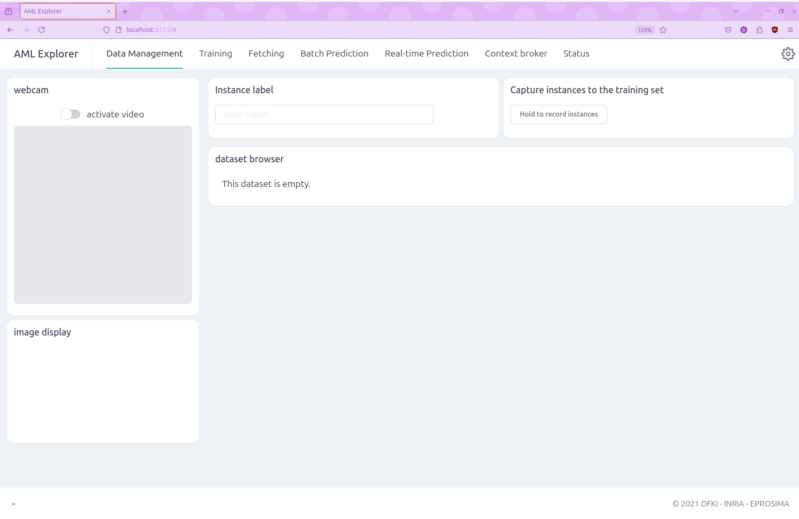
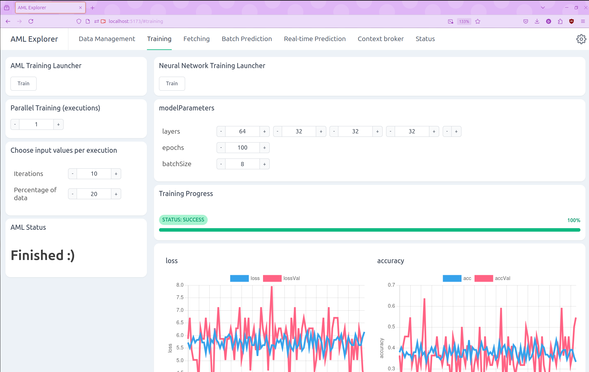
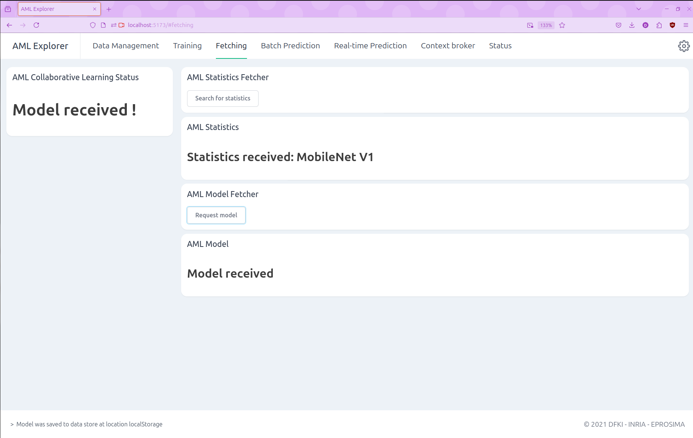
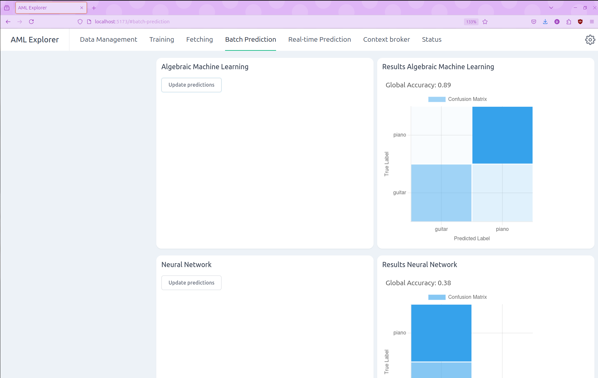
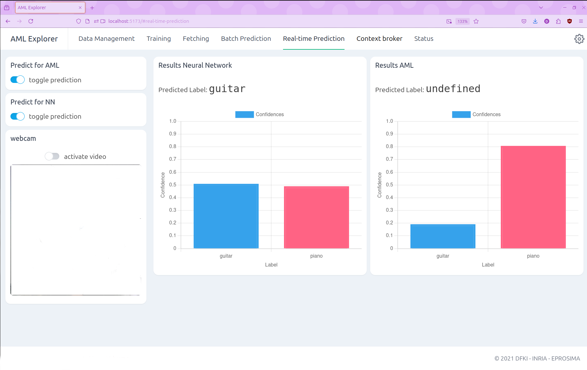
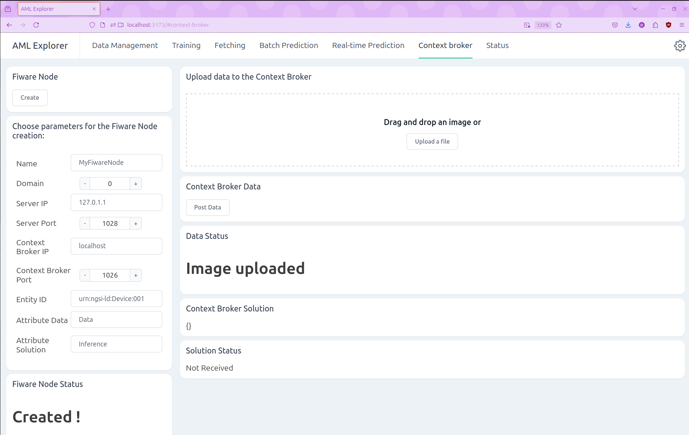
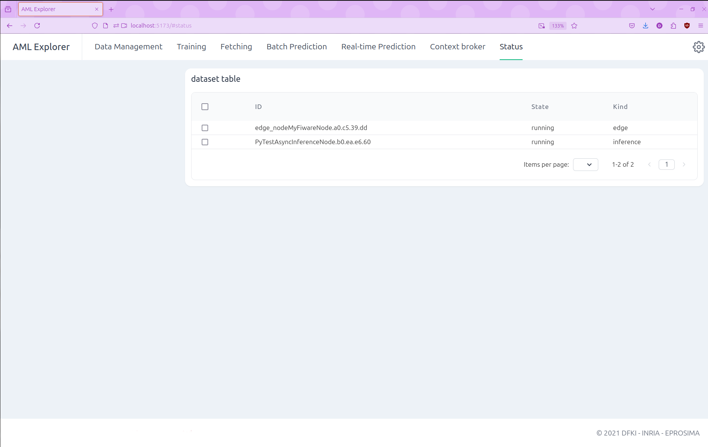

# AML-Dashboard

## Installation

To get started with AML-Dashboard, follow these steps.

Clone this repository using the following command:

```bash
git clone https://github.com/eProsima-Private/AML-Dashboard.git
```

### Building from sources

If **AML-IP** is not already installed in your system, follow one of the methods outlined in its [documentation site](https://aml-ip.readthedocs.io/en/latest/rst/developer_manual/installation/sources/linux/linux.html).

### Requirements

Before proceeding further, ensure that you have all requirements installed in your system. 
Firstly, some Python dependencies are required. This version of the AML-Dashboard uses `Python3.11`, installed in a virtual environment to install such dependencies, thus avoiding polluting the user's installation. 

Create a virtual environment and install Python dependencies.

```bash   
    python3 -m venv fastdds-docs-venv
    source fastdds-docs-venv/bin/activate
    wget https://raw.githubusercontent.com/eProsima-Private/AML-Dashboard/main/requirements.txt
    pip3 install -r requirements.txt
```

* Note: pipx can also be used for users who prefer that as an alternative for managing Python packages in isolated environments.

Install **npm** (8.5.1) and **nodejs** (v12.22.9) using the following commands:

```bash
sudo apt install -y npm nodejs
```

Verify the installed versions using:

```bash
npm -v
node -v
```

Navigate to the [`frontend/aml_dashboard`](frontend/aml_dashboard) directory and install the frontend dependencies:

```bash
cd frontend/aml_dashboard
npm i
```

Finally, ensure that FIWARE Context Broker is correctly installed, following the steps provided [here](https://github.com/telefonicaid/fiware-orion/blob/master/docker/README.md#1-the-fastest-way).

By following these steps, you'll have AML-Dashboard up and running, equipped with all the necessary components and dependencies.

## Docker

Alternatively, you can use the **AML-Dashboard Docker** image with all dependencies pre-installed.

Here's how you can build the Docker image from the provided [Dockerfile](Dockerfile). Simply execute the following command from the top-level directory:

```bash
docker build -t amlip --no-cache -f Dockerfile .
```

Run the docker container executing the following command:

```bash
docker run -it \
    --net=host \
    --ipc=host \
    --privileged \
    amlip
```

## Execution

### Backend Server

To run the AML-IP nodes and the backend server, follow the steps below:

Navigate to the [backend](backend) directory

```bash
cd backend/
```

**Run the server**

1. Load the AML-IP environment

	```bash
	source /AML-IP/install/setup.bash
	```

2. Start the [server](backend/server.py)

	```bash
	python3 server.py
	```

**Run AML-IP nodes**

Depending on your requirements, you can run different types of AML-IP nodes:

* **Run a Computing Node**

	1. Load the AML-IP environment

		```bash
		source /AML-IP/install/setup.bash
		```

	2. Start the [Computing Node](backend/computing.py)

		```bash
		python3 computing.py
		```

	You can run multiple computing nodes simultaneously. Each computing node will continuously await job assignments. When running multiple nodes, they will collectively distribute the workload, optimizing the time to find a solution.

	To stop a computing node, simply run `ctrl+C`.

* **Run a Model Manager Sender Node**

	1. Load the AML-IP environment

		```bash
		source /AML-IP/install/setup.bash
		```

	2. Start the [Model Manager Sender Node](backend/sender.py)

		```bash
		python3 sender.py
		```

	To stop a model manager sender node, simply run `ctrl+C`.

* **Run an Inference Node**

	1. Load the AML-IP environment

		```bash
		source /AML-IP/install/setup.bash
		```

	2. Start the [Inference Node](backend/inference.py)

		```bash
		python3 inference.py
		```

	To stop an inference node, simply run `ctrl+C`.

### Frontend Marcelle Framework

To run the frontend Marcelle framework, follow the steps below:

**Launch the dashboard**

1. Navigate to the [*frontend/aml_dashboard*](frontend/aml_dashboard) directory

	```bash
	cd frontend/aml_dashboard
	```

2. Run the dashboard

	```bash
	npm run dev
	```

With these steps completed, you're all set to utilize the AML-Dashboard, seamlessly integrating backend server functionalities with the Marcelle framework frontend.


## Usage

With the AML-Dashboard up and running, you can access it at the following address:

```bash
http://localhost:5173/
```

### Data Management Tab

Efficiently manage and create new datasets.

To create a dataset, simply follow these steps:

1. Activate the `video` switch in the *webcam* section to enable webcam capture.
2. Specify the label of the dataset in the *Instance label* section.
3. Click on the `Hold to record instances` button in the *Capture instances to the training set* to start recording instances.
4. Once recorded, the dataset will be promptly displayed in the *dataset browser* section for easy access and management.

<div align="center">
  
</div>

### Training Tab

Effortlessly train models using either AML or Neural Network.

To train a model using AML, follow these steps:

* Note: Before starting, please ensure that at least one **Computing Node** is running to facilitate the training process.

1. Specify the number of parallel trainings (executions) you wish to run.
2. Define the number of iterations per execution.
3. Set the percentage of dataset to distribute in each execution.
4. Click on the `Train` button in the *AML Training Launcher* to initiate the training process.
5. Once the training is completed, the model status will appear as **Finished :)** in the *AML Status*.


<div align="center">
  
</div>

### Fetching Tab

Retrieve trained AML Models effortlessly.

To fetch a model, follow these steps:

* Note: make sure that at least one **Model Manager Sender Node** is running to facilitate the model fetching process.

1. Click on the `Search for statistics` button in the *AML Statistics Fetcher*.
2. Once the statistics are received, the status will appear as **Statistics received !** in the *AML Collaborative Learning Status*.
3. Click on the `Request model` button in the *AML Model Fetcher*.
4. Once the model is received, the status will change to **Model received !** in the *AML Collaborative Learning Status*.


<div align="center">
  
</div>

### Batch Prediction Tab

Effortlessly predict the output of a batch of inputs using an AML Model.

To predict the output of a dataset, follow these steps:

* Note: Before staring, ensure that you have access to at least one AML Model to facilitate the batch prediction process.

1. Click on the `Update predictions` button in the *Algebraic Machine Learning*.
2. The predictions will be displayed in the *Results Algebraic Machine Learning* plot.


<div align="center">
  
</div>

### Real-Time Prediction Tab

Experience real-time image prediction, utilizing either an AML Model or a Neural Network.

To predict the output of webcam images in real-time using an AML Model, follow these steps:

* Note: Before starting, ensure that you have access to at least one AML Model to facilitate the real-time prediction process.

1. Toggle the `prediction` switch in the *Predict for AML* section and activate the `video` switch in the *webcam* section.
2. The predictions will be displayed in the *Results AML* plot.


<div align="center">
  
</div>

### Context Broker Tab

Effortlessly manage the Context Broker, allowing you to create and update data to an entity and get the solution of this data.

Here's how to use it:

* Note: Before starting, make sure that the Context Broker is running to ensure successful interaction and data exchange.

1. Specify the Fiware Node parameters and Context Broker entity ID and attributes.
2. Click on the `Create` button to create the node using the provided parameters.
3. The *Fiware Node Status* will update to indicate whether the node has been created successfully.
3. Drag and drop an image or upload a file in the designated area to upload data.
4. Click the `Post Data` button to send the data to the Context Broker.
5. The *Data Status* will update to indicate whether the data has been successfully posted.
6. Once the solution is received, it will be displayed in the *Context Broker Solution* section and the *Solution Status* will update to **Solution received !** to indicate successful retrieval.


<div align="center">
  
</div>

### Status Tab

Get a detailed overview of the currently active AML-IP nodes within the network.

Here's what it entails:

* **[ID](https://aml-ip.readthedocs.io/en/latest/rst/user_manual/nodes/nodes.html#node-id)**: Each node in the network has a unique Id. This Id is generated by combining the node's name with a randomly generated number, ensuring its uniqueness.
* **[State](https://aml-ip.readthedocs.io/en/latest/rst/user_manual/nodes/nodes.html#node-state)**: This indicates the current operational status of each node, providing valuable insights into their functionality.
* **[Kind](https://aml-ip.readthedocs.io/en/latest/rst/user_manual/nodes/nodes.html#node-kind)**: Every node is categorized into a specific kind, defining their behavior and role within the network. There are no restrictions on the number of nodes of the same kind that can operate concurrently within the network.

The status tab automatically refreshes every second, ensuring you receive real-time updates and information about the network's status.

<div align="center">
  
</div>
